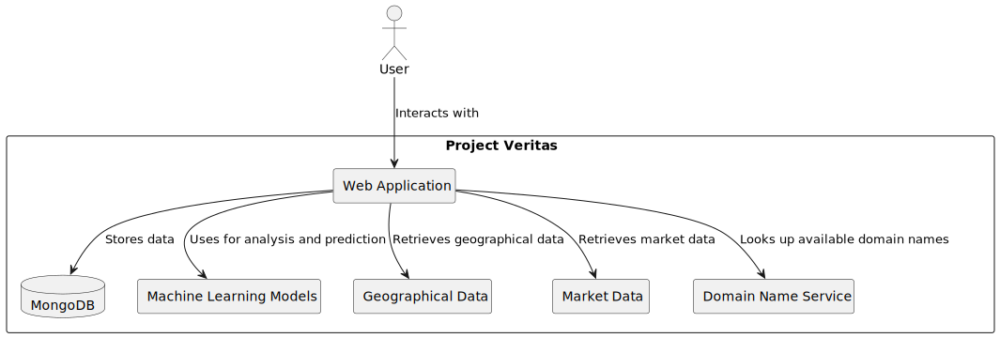

<p><a target="_blank" href="https://app.eraser.io/workspace/QhDlcQi4R27BhVcyCgEw" id="edit-in-eraser-github-link"></a></p>

**Project Veritas README**


# Project Veritas



## Overview

Project Veritas is an innovative web application that empowers aspiring entrepreneurs and business enthusiasts to effortlessly create comprehensive business plans with just a few pieces of information. With the goal of simplifying the process of turning an idea into a full-fledged business, Project Veritas leverages the power of machine learning and data analysis to generate business plans, suggest business names, identify available domain names, recommend ideal locations, assess market potential, and estimate the probability of success based on historical data from similar business sectors.

## Key Features

- **Business Plan Generation**: Project Veritas streamlines the process of creating a business plan by guiding users through a series of prompts. Users provide minimal information, and the application generates a complete business plan based on their responses.

- **Business Name Suggestions**: The app offers intelligent suggestions for business names, ensuring that your venture has a memorable and distinctive identity.

- **Domain Name Lookup**: Project Veritas helps users find available domain names, making it easy to establish a strong online presence for their business.

- **Ideal Location Recommendations**: Leveraging geographical data and market trends, the application recommends ideal locations for setting up the business to maximize its potential.

- **Market Analysis**: Project Veritas provides valuable insights into the chosen market, including size, demographics, competition, and growth prospects.

- **Probability of Success**: By analyzing historical data from similar business sectors, the application estimates the probability of success, helping users make informed decisions.

## Technology Stack

- **Framework**: Django
- **Database**: MongoDB
- **Machine Learning**: Python-based machine learning models for data analysis and prediction
- **Web Development**: HTML, CSS, JavaScript
- **Hosting**: Deploy on cloud platforms like AWS, Azure, or Heroku

## Getting Started

To run Project Veritas locally, follow these steps:

1. Clone this repository to your local machine.

   ```bash
   git clone https://github.com/Chalebgwa/project_veritas
   ```

2. Navigate to the project directory.

   ```bash
   cd veritas
   ```

3. Create a virtual environment (optional but recommended).

   ```bash
   python -m venv venv
   ```

4. Activate the virtual environment.

   ```bash
   # On Windows
   venv\Scripts\activate
   # On macOS and Linux
   source venv/bin/activate
   ```

5. Install the required dependencies.

   ```bash
   pip install -r requirements.txt
   ```

6. Configure the MongoDB database connection in `settings.py`.

7. Run the application.

   ```bash
   python manage.py runserver
   ```

8. Access the application in your web browser at `http://localhost:8000`.

## Contributing

We welcome contributions from the community to enhance Project Veritas. If you would like to contribute, please follow these guidelines:

1. Fork the repository.

2. Create a new branch for your feature or bug fix.

3. Make your changes and ensure that the codebase is clean and well-documented.

4. Test your changes thoroughly.

5. Submit a pull request explaining your changes and why they are valuable.

## License

Project Veritas is open-source software released under the [MIT License](LICENSE). Feel free to use, modify, and distribute it as needed.

## Contact

<!-- For any questions, feedback, or suggestions regarding Project Veritas, please contact us at [your.email@example.com](mailto:your.email@example.com). -->

Thank you for choosing Project Veritas for your business planning needs. We look forward to helping you turn your ideas into successful ventures!